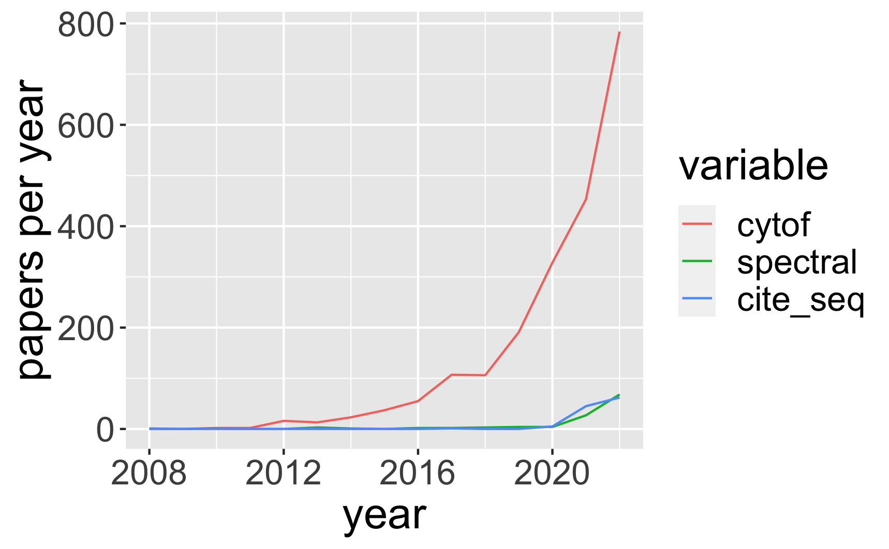

# PubMed Trends

## Description
Download PubMed data for predictive analytics.

## How to use:

### src/get_pubmed_data.Rmd
Add to a list of search queries that I have already started. PubMed searches are pulled into data frames and saved in output/.

### src/get_trends.Rmd
The aforementioned data frames are read, and per-year trends are collected. These are then plotted as line graphs and saved to output/images.

### src/sandbox.Rmd
You get to see the different things that I tried before converging on the content of the scripts above.

## Example
Here is an example of the type of output get_trends.Rmd products:

